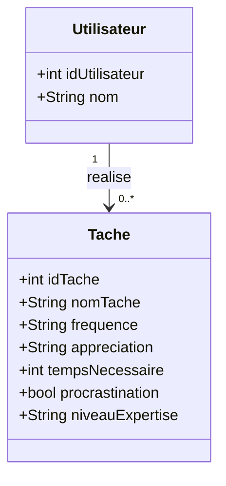

# Diagramme de classes – Exercice 2.a

Ce diagramme représente les données nécessaires pour numériser l'exercice 2.a « All the Things You Do ».

```mermaid
classDiagram

    class Utilisateur {
        +int idUtilisateur
        +String nom
    }

    class Tache {
        +int idTache
        +String nomTache
        +String frequence
        +String appreciation
        +int tempsNecessaire
        +bool procrastination
        +String niveauExpertise
    }

    Utilisateur "1" --> "0..*" Tache : realise
```
